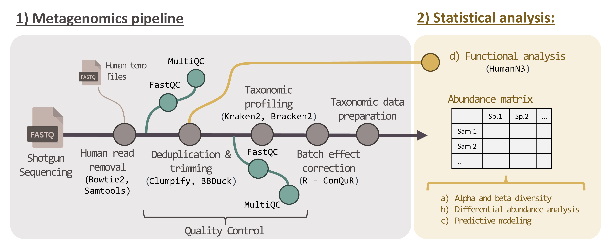

# metagenomics_pipeline

Shotgun metagenomics pipeline for processing microbiome samples

---      
             
## Table of contents             

- [0 - Overview](#over) - Overview of the project's purpose and goals
- [1 - Respository structure](#rep_stru) - Instructions on how to begin with this project
- [2 - Prerequisites](#prere) - Required software and installation steps 
- [3 - Workflow](#workflow) - Detailed guide to each stage of the project
- [4 - Authors](#authors) - Detailed guide to each stage of the project 
 
## 0 - Overview  

This repository provides a generalized bioinformatics pipeline for processing,
analyzing, and visualizing shotgun metagenomic data. The workflow includes
standard preprocessing steps such as host (e.g., human) read removal, quality
control, deduplication, trimming, and adapter removal.

Downstream analyses cover taxonomic profiling with tools like Kraken2 and
Bracken2, batch effect correction, and statistical evaluation of microbial
community composition.

The pipeline also supports compositional data analysis, alpha and beta diversity
metrics, differential abundance testing using ANCOM-BC and LINDA, and functional
microbiome profiling with HUMAnN3.

While specific parameters and datasets may differ across projects, the overall
structure follows best practices commonly adopted in microbiome research.

## 1 - Respository structure 

The table below summarizes the main files and directories in this repository, along with a brief description of their contents.
|File  |Description            |
|:----:|-----------------------|
|[scripts/](scripts/)|Folder containing all scripts used to build the workflow.|
|[docs/](docs/)|This folder includes PDF and PNG files that help illustrate the workflow, along with example tables and resulting plots.|

## 2 - Prerequisites 
This workflow is currently designed to run in high-performance computing (HPC) environments using `SLURM` job scheduling with `Bash scripts` (#!/bin/bash).
`RStudio` has been used for the statistical analysis components, complementing the pipeline with advanced microbiome data exploration and visualization.

The initial preprocessing steps require substantial memory and storage resources. For example, each compressed paired-end sample (forward + reverse) may range from 1.5 to 3.5 GB.
After deduplication and trimming, intermediate files can reach 3–8 GB per sample.

To optimize storage usage, temporary files—such as the extracted human reads—can be optionally excluded from being saved.

The table below provides a summary of the main tools used in this repository, along with a brief description of their purpose and functionality.
| Tool       | Description                                                                                   |
|:----------:|-----------------------------------------------------------------------------------------------|
| R    | Used for downstream statistical analysis, visualization, batch effect correction (e.g., ConQuR), and compositional data transformations in R. |
| Python     | Supports various preprocessing and formatting tasks; used for converting classification outputs (e.g., with `combine_mpa.py`, `kreport2mpa.py`) and preparing abundance tables. |
| bowtie2    | Aligns raw reads to the human genome to identify and remove host contamination.      |
| Samtools   | Extracts unaligned (non-human) reads from Bowtie2 output to generate cleaned FASTQ files.     |
| FastQC     | Assesses the quality of raw and processed sequencing reads.                                   |
| MultiQC    | Aggregates FastQC reports across samples into a single summary for easier interpretation.     |
| Clumpify   | Removes duplicate reads from shotgun sequencing data to reduce redundancy and file size.      |
| BBTools    | Suite containing Clumpify and BBDuk; used for deduplication, trimming, and quality filtering. |
| BBDuk      | Trims low-quality bases (PHRED > 20) and removes adapter sequences from reads.                |
| Kraken2    | Performs taxonomic classification of quality-controlled reads using k-mer-based matching.     |
| Bracken2   | Refines Kraken2 taxonomic assignments to improve species-level abundance estimation.          |

## 3 - Workflow 

> ⚠️ **Warning**: The workflow is divided into two main sections:  
> **1. Metagenomics Pipeline** – Covers preprocessing steps from raw FASTQ files to taxonomic abundance tables.  
> **2. Statistical Analysis** – Includes diversity metrics, differential abundance testing, and predictive modeling.  
>  
> Below is a high-level overview of the steps involved in each section.  
> For detailed usage instructions, please refer to the dedicated README inside each folder.
---

### 1. Metagenomics pipeline

[scripts/1_Metagenomics_pipeline](scripts/1_Metagenomics_pipeline)

Part1:

- `1_human_remove.sh` - Aligns raw reads to the human genome using Bowtie2 (--very-sensitive-local -k 1) and removes human reads using Samtools.
- `2_QC_before.sh` - Initial Quality Control (QC). Performs quality assessment on raw FASTQ files using FastQC and aggregates reports with MultiQC.
- `3_dedup_trim.sh` - Deduplication and Trimming. Removes duplicate reads using Clumpify, applies quality trimming (PHRED > 20) and adapter removal using BBDuk, and discards read pairs where one read is shorter than 75 bp.
- `4_QC_after.sh` - Post-Trimming Quality Control. Re-runs FastQC and MultiQC to assess quality improvements after trimming.
Taxonomic Profiling:
- `5.1_kraken.sh` – Classifies clean reads using Kraken2 with a 0.1% confidence threshold against the UHGG database.
- `5.2_braken.sh` – Refines species-level abundance estimates using Bracken with a read-length parameter of 150 bp.
- `5.3_krakentools2.sh` – Converts Kraken2/Bracken output into MetaPhlAn-style (MPA format) abundance tables for downstream analysis.

Part2:

- `6_batch_correction.rmd` - (Optional) Batch Effect Correction. Applies batch effect correction using the ConQuR package if technical variation is detected across sample groups.
- `7_taxonomic_data_preparation.rmd` - Taxonomic Data Preparation. Prepares taxonomic abundance data for statistical analysis: includes genome length normalization, zero replacement using zCompositions, compositional data handling, and centered log-ratio (CLR) transformation.
- `8_phyloseq_object_creation.rmd` - (Optional) Phyloseq Object Creation. Builds a phyloseq object from the processed abundance table, taxonomy assignments, and metadata (e.g., case vs. control) for structured downstream ecological and statistical analysis.
                   

### 2. Statistical Analysis:
[scripts/2_statistical_analysis](scripts/2_statistical_analysis)

            a. Alpha and beta diversity – Alpha diversity calculated with Shannon and Chao1 indices; beta diversity assessed using Aitchison distance and PERMANOVA.
            b. Differential abundance analysis – Performed using ANCOM-BC and LINDA.
            c. Predictive modeling – Includes LASSO regression with glmnet and performance evaluation via AUC.
            d. Functional analysis – Functional profiling of metagenomic reads was performed using HUMAnN3, allowing the identification of gene families and metabolic pathways. Results were normalized (copies per million), stratified by taxonomy when appropriate, and used for downstream comparisons of functional potential across sample groups.

### 3. Data Visualization:
            a. Volcano plots – Run volcano_plot.R to visualize differentially abundant taxa or pathways.
            b. Heatmaps – Use heatmap.R to generate heatmaps for significant microbial associations.
            c. (Optional additional items can be listed here, such as ordination plots or bar charts, if applicable.)

## 4 - Authors 
This pipeline was primarily developed and implemented by:

Núria Moragas, PhD – [@nmoragas](https://github.com/nmoragas)
Designed, developed, and documented the full metagenomics pipeline, including data preprocessing, taxonomic classification, functional profiling, and downstream analyses.

The statistical analysis section integrates specific functions contributed by:

Elies Ramon, PhD – [@elies-ramon](https://github.com/elies-ramon)
Provided and adapted several functions used for alpha and beta diversity, as well as parts of the compositional data analysis pipeline.
